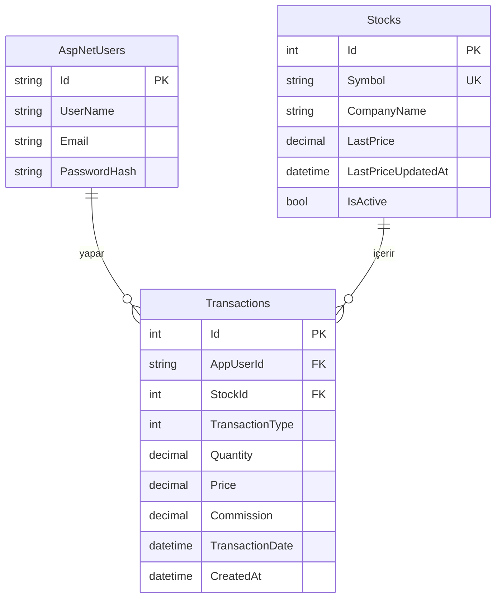

# BIST Hisse Kar/Zarar Takip Uygulaması — Proje Planı

Bu belge, Borsa İstanbul'da alınıp satılan hisselerin kar/zarar takibini yapan bir web uygulamasının geliştirme planıdır. Her kullanıcı sisteme giriş yapar ve yalnızca kendi işlemlerini ve portföyünü görür. Yapı, referans aldığımız FinShark projesindeki gibi **tek proje + tipe göre klasör** düzeniyle kurulur.

---

## 1. Genel Bakış

Kullanıcı sisteme kaydolur/giriş yapar, yaptığı alım ve satım işlemlerini kaydeder; uygulama bu işlemlerden yola çıkarak her hisse için:

- Elde tutulan adet (net pozisyon)
- Ortalama maliyet
- Güncel değer (son fiyata göre)
- Gerçekleşmemiş kar/zarar (henüz satılmamış pozisyon)
- Gerçekleşen kar/zarar (satılan pozisyonlardan elde edilen)

değerlerini hesaplar ve gösterir.

**Temel prensip:** İşlemler (`Transactions`) tek gerçek kaynaktır. Portföy, ortalama maliyet ve kar/zarar bu işlemlerden **türetilir**; ayrı bir yerde ikinci kez tutulup senkron tutma derdine girilmez (başlangıç için).

---

## 2. Teknoloji Yığını

| Katman | Teknoloji | Not |
|---|---|---|
| Backend | .NET (ASP.NET Core Web API) | Tek proje |
| ORM | Entity Framework Core | Code-first + migration |
| Kimlik doğrulama | ASP.NET Core Identity + JWT | Register/login + token'la API koruması |
| Veritabanı | PostgreSQL veya SQL Server | İkisi de uygun; EF Core soyutlar |
| Frontend | React | Ayrı proje, API'yi tüketir |
| Fiyat verisi | Dış kaynak (gecikmeli) + arka plan job | Sonraki fazda eklenir |

> Not: BIST gerçek zamanlı verisi lisanslıdır. Ücretsiz kaynakların çoğu ~15 dakika gecikmelidir. Başlangıçta fiyatı elle veya sabit değerle girip, canlı fiyat entegrasyonunu sonraki bir fazda ekleyebilirsin.

---

## 3. Mimari

### 3.1 Yaklaşım

Tek proje (`api`), içinde role/tipe göre ayrılmış klasörler. Katman ayrımı fiziksel olarak ayrı projelerle değil, **klasör disipliniyle** sağlanır. Bağımlılık akışı:

```
Controller  →  Service  →  IRepository (interface)  ←  Repository (EF Core)
                                                          ↓
                                                       DbContext  →  Veritabanı
```

Service katmanı somut `Repository` yerine `IRepository` interface'ini tanır; gerçek implementasyon DI ile enjekte edilir. Böylece iş mantığı (kar/zarar hesabı) veritabanı teknolojisinden habersiz kalır ve izole test edilebilir.

### 3.2 Klasör Yapısı ve İçeriği

| Klasör | Ne için | Bu projede içine ne girecek |
|---|---|---|
| `Controllers` | API giriş noktaları, endpoint'ler | `AccountController`, `StockController`, `TransactionController`, `PortfolioController` |
| `Models` | Entity'ler (domain nesneleri) | `AppUser`, `Stock`, `Transaction` |
| `Data` | `DbContext` ve EF Core yapılandırması | `ApplicationDbContext` |
| `Interfaces` | Soyutlamalar | `IStockRepository`, `ITransactionRepository`, `IPortfolioService` |
| `Repository` | Interface'lerin EF Core implementasyonu | `StockRepository`, `TransactionRepository` |
| `Service` | İş mantığı | `PortfolioService` (kar/zarar), ileride `PriceSyncService` |
| `Dtos` | Dışarı açılan request/response şekilleri | `StockDto`, `CreateTransactionDto`, `PortfolioItemDto` |
| `Mappers` | Entity ↔ DTO dönüşümü | `StockMappers`, `TransactionMappers` |
| `Extensions` | Extension method'lar | Token'dan kullanıcı adını çeken `ClaimsExtensions` |
| `Helpers` | Yardımcı sınıflar | Filtreleme/sayfalama parametreleri (`QueryObject`) |
| `Migrations` | EF Core migration'ları | Otomatik üretilir |
| `Properties` | `launchSettings.json` vb. | Proje ayarları |

### 3.3 Testedilebilirlik

Ayrı bir test projesi (`api.Tests`) açılır, `api` projesini referans verir. `Service` katmanındaki kar/zarar mantığı, sahte (fake/mock) `IRepository` verilerek **veritabanı olmadan** test edilir. Bu, tek projede de mümkündür; interface + DI disiplini sayesinde.

---

## 4. Veritabanı Şeması

Üç çekirdek tablo var: kullanıcılar (Identity'den gelir), hisse ana listesi ve işlemler.



İlişkiler: Bir kullanıcının çok sayıda işlemi olabilir (1—N). Bir hisse çok sayıda işlemde geçebilir (1—N). `Transactions` tablosu bu iki tarafı birbirine bağlayan merkez tablodur.

### 4.1 AspNetUsers (AppUser) — Kimlik

ASP.NET Core Identity ile gelir. `IdentityUser`'dan türeyen `AppUser` sınıfı standart alanları hazır verir. Şifreyi asla düz metin tutmazsın; Identity hash'leyerek saklar.

| Alan | Tip | Neden tutulur |
|---|---|---|
| `Id` | string (GUID) | Birincil anahtar; her kullanıcının benzersiz kimliği. İşlemler bu Id ile kullanıcıya bağlanır — "her kullanıcı kendi listesini görür" mantığının temeli. |
| `UserName` | string | Giriş ve görüntüleme için kullanıcı adı. |
| `Email` | string | İletişim, giriş, şifre sıfırlama. |
| `PasswordHash` | string | Şifrenin hash'lenmiş hâli. Identity yönetir; düz şifre asla tutulmaz. |

> `IdentityUser` ayrıca `SecurityStamp`, `EmailConfirmed`, `LockoutEnd` gibi alanlar da getirir. Bunlarla elle uğraşmazsın; Identity kullanır.

### 4.2 Stocks — Hisse Ana Listesi (referans verisi)

Tüm BIST hisselerinin ortak listesi. Kullanıcıya özel değildir; herkes aynı listeden arama yapar. İleride bir arka plan job'u ile dış kaynaktan otomatik senkronlanır.

| Alan | Tip | Neden tutulur |
|---|---|---|
| `Id` | int | Birincil anahtar. İşlemler bu Id ile hisseye bağlanır (string sembol yerine int join daha hızlı). |
| `Symbol` | string | Hisse kodu (THYAO, GARAN). Kullanıcının arayıp tanıdığı değer. **Unique index** konur: hem hızlı arama hem de aynı hissenin iki kez eklenmesini engeller. |
| `CompanyName` | string | Şirketin tam adı. Autocomplete'te ve listede okunabilirlik için. |
| `LastPrice` | decimal | Son bilinen fiyatın önbelleği. Kullanıcı hisse seçtiğinde dış API'ye gitmeden anında fiyat gösterebilmek için. Para/fiyat alanlarında **decimal** kullan (float değil — yuvarlama hatası olur). |
| `LastPriceUpdatedAt` | datetime | Fiyatın en son ne zaman güncellendiği. "15 dk gecikmeli" gibi tazelik bilgisini göstermek ve job'un ne zaman yenileyeceğine karar vermek için. |
| `IsActive` | bool | Hisse hâlâ işlem görüyor mu? Kotasyondan çıkanlar `false` yapılır: aramada gizlenir ama **silinmez**, çünkü kullanıcının o hisseyle geçmiş işlemleri bozulmasın. (Soft delete) |

**Opsiyonel/ileride:** `Sector`, `Market` (pazar), `Isin` gibi meta alanlar gruplama/filtreleme için eklenebilir.

### 4.3 Transactions — Alım/Satım İşlemleri (uygulamanın kalbi)

Her satır, bir kullanıcının tek bir alım **veya** satım işlemidir. Portföy ve kar/zarar tamamen buradan hesaplanır.

| Alan | Tip | Neden tutulur |
|---|---|---|
| `Id` | int | Birincil anahtar. |
| `AppUserId` | string (FK) | İşlemi kimin yaptığı. `AspNetUsers.Id`'ye bağlanır. **Her sorgu bu alanla filtrelenir** — kullanıcı izolasyonunun anahtarı. |
| `StockId` | int (FK) | Hangi hisse. `Stocks.Id`'ye bağlanır; sembol, isim ve güncel fiyat buradan gelir. |
| `TransactionType` | int (enum) | Alım mı satım mı? `0 = Buy`, `1 = Sell`. Kar/zarar matematiğinin yönünü belirler. Enum olarak tutulur, DB'de int saklanır. |
| `Quantity` | decimal | Adet. Maliyet ve satış tutarı hesabı için. BIST genelde tam lot olsa da fraksiyon ihtimaline karşı decimal güvenli. |
| `Price` | decimal | İşlem anındaki birim fiyat. Alımda maliyet, satımda satış geliri bundan hesaplanır. |
| `Commission` | decimal | Aracı kurum komisyonu/masrafı. **Gerçek** kar/zarar için şart; komisyon göz ardı edilirse kar olduğundan fazla görünür. |
| `TransactionDate` | datetime | İşlemin gerçekleştiği tarih. FIFO sıralaması ve dönemsel raporlama için. Kaydın oluşturulma anından (`CreatedAt`) farklıdır — kullanıcı geçmiş bir işlemi sonradan girebilir. |
| `CreatedAt` | datetime | Satırın sisteme yazıldığı an. Denetim/iz kaydı için. |
| `Notes` | string (opsiyonel) | Kullanıcının kendi notu (örn. "temettü öncesi alım"). |

### 4.4 (Opsiyonel — İleride) Watchlist / İzleme Listesi

Kullanıcının henüz almadığı ama takip etmek istediği hisseler için ayrı bir çok-a-çok tablo (`AppUser` ↔ `Stock`). Şu anki kapsam için gerekli değil; "kendi hisse listesi" zaten işlemlerden türetiliyor. İleride "favori/izleme" özelliği istersen eklenir.

### 4.5 Türetilen Değerler (tabloda tutulmaz, hesaplanır)

Aşağıdakiler DB'de saklanmaz; `PortfolioService` içinde işlemlerden hesaplanır:

- **Net pozisyon (adet):** o hisse için `Σ(alım adet) − Σ(satım adet)`
- **Ortalama maliyet:** `Σ(alım tutarı + komisyon) / Σ(alım adet)`
- **Gerçekleşmemiş K/Z:** `(LastPrice − ortalama maliyet) × elde tutulan adet`
- **Gerçekleşen K/Z:** satış işlemlerinden elde edilen net kar

> Performans gerekirse ileride bu değerler bir `PortfolioSnapshot` tablosunda önbelleğe alınabilir. Başlangıçta gerek yok — işlemlerden anlık hesaplamak yeterince hızlıdır.

---

## 5. Kar/Zarar Hesaplama

### 5.1 Yöntem seçimi: Ortalama Maliyet vs FIFO

**Ortalama maliyet (önerilen başlangıç):** Tüm alımların ağırlıklı ortalaması tek bir maliyet verir. Basit, Türkiye'de yaygın.

```
Ortalama maliyet = (Σ alım tutarı + Σ alım komisyonu) / Σ alınan adet
```

**FIFO (First-In-First-Out):** Her satış, en eski alım lotlarından düşülür. Vergi/lot bazında daha hassastır ama lot takibi gerektirir, daha karmaşıktır. İleride bir seçenek olarak eklenebilir.

Başlangıç için **ortalama maliyet** ile ilerle; hesaplama mantığını `Service` katmanında izole tuttuğun için sonradan FIFO'ya geçmek zor olmaz.

### 5.2 Gerçekleşmemiş vs Gerçekleşen

- **Gerçekleşmemiş K/Z (unrealized):** Hâlâ elinde tuttuğun pozisyonun kağıt üzerindeki karı. `(güncel fiyat − ortalama maliyet) × elde tutulan adet`. Güncel fiyat değiştikçe değişir.
- **Gerçekleşen K/Z (realized):** Sattığında kesinleşen kar. `(satış fiyatı − ortalama maliyet) × satılan adet − satış komisyonu`.

### 5.3 Komisyonun önemi

Komisyon hem alımda maliyeti artırır hem satımda geliri azaltır. Doğru bir takip uygulaması için komisyonu mutlaka işleme dahil et; yoksa gösterilen kar gerçekte olduğundan yüksek çıkar.

---

## 6. Kimlik Doğrulama ve Yetkilendirme

### 6.1 Akış

1. Kullanıcı `POST /api/account/register` ile kaydolur (Identity kullanıcıyı hash'lenmiş şifreyle oluşturur).
2. `POST /api/account/login` ile giriş yapar; başarılıysa API bir **JWT token** döner.
3. React, bu token'ı saklar ve sonraki her isteğin `Authorization: Bearer <token>` başlığında gönderir.
4. Korumalı endpoint'ler `[Authorize]` ile işaretlenir; token geçersizse istek reddedilir.

### 6.2 Kullanıcı izolasyonu — "herkes kendi listesini görür"

Bu, tasarımın en kritik güvenlik noktası:

- İşlem/portföy sorgularında kullanıcı Id'si **istekten (body/query) değil, doğrulanmış token'dan** alınır. Token'daki claim'lerden kullanıcı adı/Id çekilir (örn. bir `ClaimsExtensions` yardımıyla).
- Her `Transactions` sorgusu `WHERE AppUserId == currentUserId` ile filtrelenir.
- Bir kullanıcı, başka birinin işlem Id'sini bilse bile ona erişemez; çünkü sorgu her zaman token'daki kullanıcıya kilitlidir.

> Güvenlik kuralı: Kullanıcı Id'sine asla client'ın gönderdiği değere güvenerek karar verme. Her zaman sunucudaki doğrulanmış kimlikten al.

---

## 7. API Endpoint Taslağı

| Method | Endpoint | Açıklama | Koruma |
|---|---|---|---|
| POST | `/api/account/register` | Yeni kullanıcı kaydı | Açık |
| POST | `/api/account/login` | Giriş, JWT döner | Açık |
| GET | `/api/stocks?search=THY` | Autocomplete için hisse arama | `[Authorize]` |
| GET | `/api/stocks/{symbol}` | Tek hisse + güncel fiyat | `[Authorize]` |
| GET | `/api/transactions` | Giriş yapan kullanıcının işlemleri | `[Authorize]` |
| POST | `/api/transactions` | Yeni alım/satım kaydı | `[Authorize]` |
| PUT | `/api/transactions/{id}` | İşlem güncelle | `[Authorize]` |
| DELETE | `/api/transactions/{id}` | İşlem sil | `[Authorize]` |
| GET | `/api/portfolio` | Türetilmiş portföy: pozisyonlar + kar/zarar | `[Authorize]` |

---

## 8. Geliştirme Yol Haritası (Dikey Dilimler)

Her faz uçtan uca (DB → API → React) tamamlanır; böylece her adımda çalışan bir parça elde edilir.

- **Faz 0 — Yürüyen iskelet:** Proje kurulumu, `ApplicationDbContext`, tek bir `Stock` kaydı, onu döndüren bir endpoint ve React'te gösterimi. Amaç: .NET + React + DB uçtan uca bağlanıyor mu?
- **Faz 1 — Kimlik doğrulama:** Identity + JWT, register/login, korumalı endpoint, React'te giriş ekranı.
- **Faz 2 — Hisse listesi + arama:** `Stocks` tablosu, autocomplete arama endpoint'i, React'te "yazdıkça çıkan" hisse seçici.
- **Faz 3 — İşlem kaydı:** `Transactions` tablosu, alım/satım ekleme formu, kullanıcının işlem listesi (token'la filtreli).
- **Faz 4 — Kar/zarar:** `PortfolioService`, ortalama maliyet + gerçekleşmemiş/gerçekleşen K/Z, portföy ekranı.
- **Faz 5 — Fiyat senkronizasyonu:** Dış kaynaktan fiyat çeken `BackgroundService`, `Stocks.LastPrice` güncelleme, hisse listesini otomatik senkronlama.

---

## 9. Sonraki Adımlar / Gelecek Geliştirmeler

- FIFO maliyet yöntemi seçeneği
- İzleme listesi (watchlist)
- Temettü kayıtları ve temettü verimi
- Dönemsel raporlar (aylık/yıllık kar-zarar)
- Grafiklerle portföy dağılımı ve zaman içindeki değer
- Fiyat alarmları
